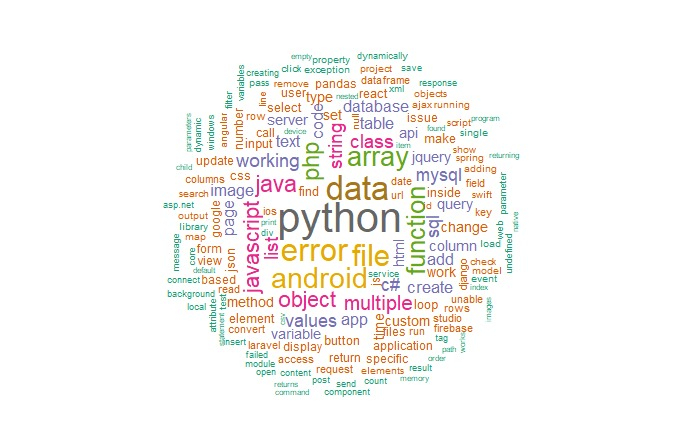
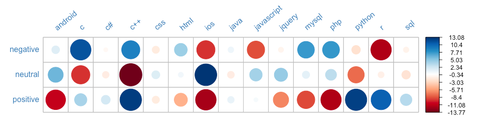
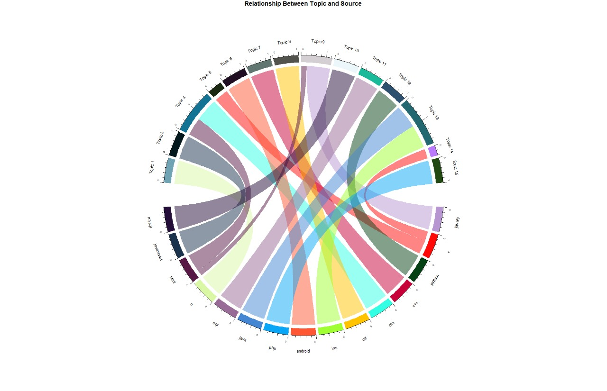
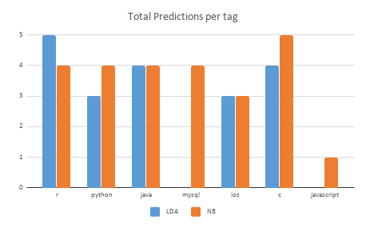

```{r setup, include=FALSE}
knitr::opts_chunk$set(echo = TRUE)
```

#Stackoverflow Analysis and Tag Prediction {-}
**Team Members:**

 * **Neetha Jambigi**
 * **Subash Prakash**
 * **Tirtha Chanda**


# Overview and Motivation: 


   With the advent of web, we have quick access to vast number of people's knowledge through Q&A forums like stack overflow, Quora etc.  We have chosen Stack Overflow, the most popular and global online Q&A forum for technology as our topic. This forum covers a vast range of domains and technologies and is a go-to forum for seeking solutions w.r.t. old and new technologies. This forum has an overwhelming number of users and activities for the technical domain. As we use Stack Overflow in our day-to-day activities, the results for us will be relatable. 
                
  We intend to use several components and features of Stack Overflow, to gain an overview of a very small section of the posts. 
They have queries, answers and comments . Posts have attributes amongst which tags are one of the most important ones. Tags are keywords which broadly identify the domain the post belongs to. It enhances the searchability and visibility of the post to appropriate audiences for the post among others. The paper [Bhat et al] demonstrates the importance of tags in stackoverflow. They model the answer time prediction based on two groups of features of which 1 is tag based. A new user who is not well versed with the platform may not be able to enjoy full benefit of the forum due to lack of fundamental information on usage. In such a scenario, tag recommendation comes as a helpful tool. This being our motivation, through this project, we have attempted to recommend 1-most appropriate tag for a post based on the textual content  and the title of the post. 
	
We have experimented with several approaches to model this data to exploit  the textual content of the posts to obtain a tag  recommendation. Also we have performed data exploration in an attempt to identify correlations in the data if any. The sections that follow in this report have  details with supporting visualizations for our EDA results.


# Data :

## Source
We can obtain the data dumps from which we can extract features as needed.
They are publicly available and hosted on https://archive.org/download/stackexchange

The names of the datasets we plan to use are:
stackoverflow.com-Posts.7z
stackoverflow.com-Comments.7z
stackoverflow.com-Users.7z
stackoverflow.com-Tags.7z

Links:

* https://archive.org/download/stackexchange/stackoverflow.com-Comments.7z
* https://archive.org/download/stackexchange/stackoverflow.com-Posts.7z
* https://archive.org/download/stackexchange/stackoverflow.com-Tags.7z
* https://archive.org/download/stackexchange/stackoverflow.com-Users.7z

These files contain the actual posts from stack overflow website(queries, solution,  etc.). They are cross-referenced in comments using the UniquePostID.
The StackOverflow.com posts have several components of which we have considered the following:
Questions & answers,
Comments( for questions and answers),
Users 


## Structure of Stack Overflow Posts 

A short introduction to structure of stack Overflow posts to set the context for the documentation ahead :

 * They consist of 3 kinds of texts the users can post : **Questions, Answers and Comments**. 
 * Question posts have Title and Body.
 * Answers also have the question ID they belong to.
 * Comments can belong to questions or answers.
 * These posts are voted up or down. This cumulative of upvote and downvote is the score a post obtains.
 * All kinds of posts can be voted and hence have scores.
 * Views is the number of times the question was viewed by the users.
 * Posts have tags that can be used to reference them to particular areas.

In our case, tags become the classes /categories/label that we attempt to predict for an incoming post. 

## Data Pre-processing :

Extraction and XML parsing:

* Extraction of these zip files, provides the respective XML files.
* XML files are parsed in R and the respective CSV's are created.


###**Posts.csv** :

The original extracted Posts file contains approximately 70 GB of data
Hence we take only the last 499,999 records (most recent data) by using the
command on the Linux terminal. To create Posts.csv, an XML parser in the R library "XML" was used to import the data into a DataFrame. Then, the DataFrame was exported as a csv.

This list of post Identifiers (ID) from posts.csv was used for matching and extracting relevant entries from the comments file. 

###**Comments.csv**

The comments file has PostId as an attribute. We take only those entries in Comments.xml that have respective entries in Posts.xml. This way we remove those comments for which we don't have the question in the Posts file. To match the comments with the PostIds using which we match the extracted PostID to get all the comments for the posts in consideration.

Similar to the processing for Posts, an XML parser in the R library "XML" was used to import the data into a DataFrame from Comments_new.xml. Then, the DataFrame was exported as a csv.

###**Users.csv**

All users given by the dataset were used. XMl file was processed similar to others to obtain a csv.


On the whole, our dataset consists of posts for a span of 3 months dating back from October,2018

**Steps to Final Dataframe**
Data Cleaning :
Only posts that have tags are selected. Question and answer posts are separated.
Only 1 tag per post from the tags columns for questions is retained.
The post body is extracted and cleaned to remove html tags.
Links and code parts of the post body are extracted to create new columns "hasLinks" and "hasCode".


# Related work: 

We have also referred to the pertaining literature in several places in this report where appropriate. All those references have been listed in the references section of this report.


# Initial Questions

We set out to answer the following questions with our project 

	* In which parts of the world is Stack Overflow mostly used? 
	* What are the top 10 common categories?
	* What is the overall sentiment of users grouped by topic? 
	* What are the most upvoted question tags?
	* Is sentiment of answers/comments correlated with the number of upvotes or downvotes?

Through the course of the project, we were able to answer the questions we initially intended to. In the following EDA section, we have answered these questions. However, the data did not really exhibit any strong correlations, reason being the time period the data spanned was too small.


# Exploratory Data Analysis

Exploratory data analysis was performed on all the components of the data set. 
Following are the sections of the EDA:

 * USERS
 * QUESTION
 * TAGS
 * CORRELATIONS


##**User Data** :

User data has been visualised based on the attributes of the users profiles.

### **Users by Geography** :
Plotting Users locations on a map

```{r out.width="100%", message=FALSE, warning=FALSE}
plot_geo(locations, sizes = c(1, 500)) %>%
    add_markers(
        x = ~lon, y = ~lat, size = ~n, color = ~n, hoverinfo = "text",
        text = ~paste(locations$Location)
    ) %>%
    layout(title = 'User Locations', geo = g)

```
	The worldwide user location obtained from the users' file has been mapped into an interactive map for the users whose location information was available. **This shows the widespread reach of the platform amongst worldwide users.**


### **Gender Distribution** :

The users' gender distribution for stack overflow.

```{r fig.align='center', out.width="70%"}
ggplot(genders, aes(x = factor(1), fill = factor(gender))) +
    geom_bar(width = 1) +
    coord_polar(theta = "y") +
    labs(x = "", y = "", title = "Gender Distribution") +
    scale_fill_manual(name = "Gender", values=c("brown3", "slateblue")) +
    theme_bw() +
    theme(axis.title.x=element_blank(),
          axis.text.x=element_blank(),
          axis.ticks.x=element_blank())
```

Gender information is not available in our stack Overflow users file. The  gender is inferred based on names of the users using gender library to obtain an overview of gender distribution for male-female users of the portal in our data. **Only less than a quarter of the users are female.**


###**Word Cloud of Users' AboutMe Sections** :


```{r fig.align='center', out.width="110%"}
dfm_aboutme <- users$TidyAboutMe %>%
    quanteda::tokens() %>%
    dfm() %>%
    dfm_trim(min_termfreq = 10, verbose = FALSE)
# plot a wordcloud
set.seed(100)
textplot_wordcloud(dfm_aboutme, max_words = 200, rotation = 0.25,
                   color = c('blue', 'green', 'purple'))
```

This forum encompasses users of various domains. This is visualization of  "About me" section from the users profiles, to obtain most prominent words using a word cloud. This helps see what areas and skills are dominant based on the users who have provided the details.

**Dominant skill as seen is programmer. There are a number of positive words about the inclination of the users to technology.**


##**Questions** :

###**Wordcloud for Question Titles Overall**



### **Wordcloud for Bi-grams in  Question Titles**


### **Frequently Co-occurring Nouns in Questions**

```{r fig.align='center', out.width="80%"}
# create a cooccuring terms graph
desc_word_pairs %>%
    filter(n >= 160) %>%
    graph_from_data_frame() %>%
    ggraph(layout = "fr") +
    geom_edge_link(aes(edge_alpha = n, edge_width = n), edge_colour = "cyan4") +
    geom_node_point(size = 2) +
    geom_node_text(aes(label = name), repel = TRUE,
                   point.padding = unit(0.2, "lines")) +
    labs(title="Most Co-occuring Words in Questions") +
    theme_void() +
    theme(plot.title = element_text(hjust = 0.5))
```
This co-occuring terms visualization was an attempt at understanding if co-occuring words can be a factor for predicting tags.  It can be seen that when we follow the highly frequent edges in the graph, we can form pseudo questions.


### **Boxplot of View Counts for Questions of each Tag**

```{r fig.align='center', out.width="80%"}

# plot question ViewCount for each tag
ggplot(questions, aes(x = Tags, y = ViewCount, fill = Tags)) +
    geom_boxplot() +
    scale_y_continuous(limits = c(0, 200)) +
    labs(title = "Question View Counts per Tag", y = "View Count", x = NULL) +
    #theme_bw() +
    theme(axis.text.x = element_text(face = "bold", size=12, angle = 60),
          axis.text.y = element_text(face = "bold", size=12, angle=0),
          plot.title = element_text(size=15), legend.position="none") +
    scale_fill_discrete(name = "Tags")
```

View counts distribution for questions from each tag. C and C++ questions tend to get viewed more often than others. This could be due to the extremely large user base of c and c++. JQuery questions get the least amount of views.

###**View Counts v/s Scores for Questions**

```{r fig.align='center', out.width="80%"}
# ViewCount Score correlation
questions %>%
    # remove a few outliers
    filter(Score < 100) %>%
    ggplot(aes(Score, ViewCount)) +
        geom_jitter(color='firebrick4', size = 0.4) +
        # fit a regression line
        geom_smooth(method='lm') +
        # scale the y axis
        scale_y_log10() +
        scale_x_continuous(breaks = pretty(questions$Score, n = 50)) +
        labs(title = "Plot of Question View Counts and Scores",
             y = "View Counts", x = "Score") +
        theme_bw() +
        theme(axis.text.x = element_text(face = "bold", size=12, angle = 60),
              axis.text.y = element_text(face = "bold", size=12, angle=0),
              plot.title = element_text(size=15), legend.position="none")


```

The plot is suggestive of a postive correlation between the scores and views of questions. There could be a causal relationship between these two as well. High scored questions may appear in Google searches more often, and in turn get more views.


### **Time Series of Frequency of Questions**

Here we have considered the data from 2017 to examine the progression of the number of question for a few tags over a month.
```{r fig.align='center', out.width="100%"}
# time series for dec 17
p1 <- dec17 %>%
    filter(Tags %in% c('python', 'javascript', 'java', 'c#', 'android')) %>%
    group_by(Tags) %>%
    ggplot(aes(x = date, y = n, color = Tags)) +
    geom_line() +
    geom_text(aes(label=day),hjust=0, vjust=0, size=1.8) +
    labs(x = "Date", y = "Count",
         title = "Number of Questions per Day for December 2017") +
    theme(axis.text.x = element_text(angle = 60, vjust = 0.5)) +
    scale_x_date(date_breaks = "2 days", date_labels = "%b %d")

# time series for jan 18
p2 <- jan18 %>%
    filter(Tags %in% c('python', 'javascript', 'java', 'c#', 'android')) %>%
    group_by(Tags) %>%
    ggplot(aes(x = date, y = n, color = Tags)) +
    geom_line() +
    geom_text(aes(label=day),hjust=0, vjust=0, size=1.8) +
    labs(x = "Date", y = "Count",
         title = "Number of Questions per Day for January 2018") +
    theme(axis.text.x = element_text(angle = 60, vjust = 0.5)) +
    scale_x_date(date_breaks = "2 days", date_labels = "%b %d")

# plot combined time series
grid.arrange(p1, p2)

```

This plot shows a pattern of the number of question dipping during the weekend while being the highest during weekdays. This pattern is commonly observed for questions of all Tags. This observation is inline with active working days patterns in most countries worldwide. Also during the end of December is observed as a holiday period and there is decrease in the number of question as compared to the month of January.

##**Tags** :

###**Tag Distribution** :

#### **Top 15 Tags and their Distributions from the Data**
```{r fig.align='center', out.width="80%"}
# plot frequency of tags
ggplot(questions, aes(x=Tags, fill=Tags)) +
    geom_bar(stat = "count") +
    labs(title = "Frequency of Tags", y = "Number of Questions", x = NULL) +
    theme_bw() +
    theme(axis.text.x = element_text(face = "bold", size=12, angle=60),
          plot.title = element_text(size=15)) +
    scale_fill_discrete(name = "Tags")
```

####**Pie Chart for Percentage Distribution of Tags**

```{r eval=FALSE} 
####### Pie Chart a Distribution#############
Tags_freq <- count(questions,Tags)

calcPercFreq <- function(x){
  return((x/nrow(questions)) * 100)
}

Tags_freq['n'] <- apply(Tags_freq['n'],1,calcPercFreq)

library("plotly")
p <- plot_ly(Tags_freq, labels = ~Tags, values = ~n, type = 'pie') %>%
  layout(title = 'Percentage of Tag Distribution in the Dataset',
         xaxis = list(showgrid = FALSE, zeroline = FALSE, showticklabels = FALSE),
         yaxis = list(showgrid = FALSE, zeroline = FALSE, showticklabels = FALSE))

```


We have unbalanced dataset with python, javascript as top-2 dominant classes.


###**Percentage of Tags over Three Months**

```{r eval=FALSE} 
######## Percentage of 15 tags across months in our dataset #####
    
    tagPMonthly <- questions %>% 
      group_by(month = substr(CreationDate,1,7)) %>% 
      count(Tags) %>%
      mutate(percN = (n/sum(n))*100)
    
    ggplot(tagPMonthly, aes(x = month, y = percN,fill=Tags)) + 
      geom_bar(stat = "identity",position = "stack") + facet_grid(~ Tags) + theme(axis.text.x = element_text(angle=45)) + xlab("Month Wise") + ylab("% of question per Tag")
```


The distribution doesn't exhibit any drastic changes in tag distributions in the 3-month span.


### **Average Score of Questions per Tag**:

Score = (#upvotes - #downvotes).
Figure for Average scores for a tag based on all the questions w.r.t the tag.

```{r fig.align='center', out.width="70%"}
ggplot(tags_summary, aes(x=reorder(Tags, avg_score), y=avg_score, fill=Tags)) +
    geom_bar(stat = "identity", width = 0.8) +
    coord_flip() +
    #djsjn
    labs(title = "Average Score per Tag", y = "Average Score", x = NULL) +
    theme_bw() +
    theme(axis.text.y = element_text(face = "bold", size=12, angle=0),
          plot.title = element_text(size=15), legend.position="none") +
    scale_fill_discrete(name = "Tags")
```

The score could be an indication of importance of a question or the quality of the question. An upvoted question could mean other people wanted an answer to that while a down vote could mean an already covered topic or poorly constructed question.

R and Python are amongst the top scored programming languages according to our data.


###**Average Comment Counts pof Questions per Tag** :

The average number of comments on the questions per tag.

```{r fig.align='center', out.width="60%"}
# plot average number of comments per question for each tag
ggplot(tags_summary, aes(x=reorder(Tags, avg_comment_count), y=avg_comment_count, fill=avg_comment_count)) +
    geom_bar(stat = "identity", width = 0.8) +
    coord_flip() +
    labs(title = "Average Number of Comments per Question for each Tag", y = "Average Number of Comments", x = NULL) +
    theme_bw() +
    theme(axis.text.y = element_text(face = "bold", size=12, angle=0),
          plot.title = element_text(size=15), legend.position="none") +
    scale_fill_continuous(name = "Comment Count")
```

C and C++ are the highest relative to other tags, eventhough they are not the most  frequent of tags. Possible interpretation being they are harder programming languages and there are more follow up comments to obtain better understanding of the question.

###**Average Answer Count for Questions per Tag** :

Average number of answers per question for each tag.
```{r fig.align='center', out.width="60%"}
# plot average number of answers per question for each tag
ggplot(tags_summary, aes(x=reorder(Tags, avg_answer_count), y=avg_answer_count, fill=avg_answer_count)) +
    geom_bar(stat = "identity", width = 0.8) +
    coord_flip() +
    labs(title = "Average Number of Answers per Question for each Tag", y = "Average Number of Answers", x = NULL) +
    theme_bw() +
    theme(axis.text.y = element_text(face = "bold", size=12, angle=0),
          plot.title = element_text(size=15), legend.position="none") +
    scale_fill_continuous(name = "Answer Count")
```
This distribution is indicative of Sql and C being in use for a very long time and hence have larger user base. Understandably they are leading the average answer count ditsribution.

### **Places the Tags are Popular in**

This plot shows the cities or places the tags are popular in.

```{r fig.align='center', out.width="60%"}
# plot popular locations for 4 tags
ggplot(tag_loc, aes(x=reorder(Var1, Freq), y = Freq, fill = Tags)) +
    geom_bar(stat = "identity", width = 0.6) +
    geom_text(aes(label=Var1),
              position=position_dodge(width=1),
              vjust="inward", hjust="inward", angle=0, size = 4) +
    coord_flip() +
    facet_wrap(~Tags, scales = "free") +
    labs(colour = "proportion", x = NULL, y = NULL, title = "Popular Tag Locations") +
    theme_gray() +
    theme(strip.text.x = element_text(size = 20),
          axis.text.y = element_blank(),
          plot.title = element_text(size=15), legend.position="none")
```

The x axis indicates the percentage of the total number of questions in that particular tag. This has been plotted only for a few tags.


###**Overall Distribution for Sentiment of Comments**

Sentiment scores have been plotted for all question comments.


```{r fig.align='center', out.width="70%", message=FALSE, warning=FALSE }
# distribution of the sentiment of comments
ggplot(questions, aes(SentimentOfComments)) +
    geom_density(fill = 'steelblue') +
    theme_bw() +
    theme(axis.text.x = element_text(face = "bold", size=6),
      plot.title = element_text(size=15)) +
    scale_fill_discrete(name = "Tags") +
    labs(x = "Average Sentiment of Comments", y = "Density", 
         title = "Average Sentiment of Comments of all Questions")
```

The sentiment scores are heavily lodged around zero. This could be due to lack of a lexicon to identify sentiments pertaining to technical text or rather due to the nature of technical posts that are usually neutral and on point. May be be assigning different range of sentiments like "gratitude" for thank you and so on can help classify these sentiments better.

###**Average Sentiments towards Questions of Tags based on Comments **
```{r fig.align='center', out.width="70%", message=FALSE, warning=FALSE }
# avg sentiment of comments grouped by tag
ggplot(questions, aes(x = Tags, y = SentimentOfComments, fill = Tags)) +
    #geom_bar(stat="identity", width = 0.7) + 
    geom_violin() +
    theme_bw() +
    theme(axis.text.x = element_text(face = "bold", size=12, angle=60),
          plot.title = element_text(size=15)) +
    scale_fill_discrete(name = "Tags") +
    labs(x = "Tags", y = "Average Sentiment of Comments", title = "Average Sentiment towards Tags")
```

As discussed above the sentiment remains mostly at 0.

## **Correlations**

This section consists of some correlation that were discovered in the data as a part of the EDA :

### **Correlation between different Features of the Questions **

```{r eval=FALSE} 
###### Correlations ###############
library(corrplot)
score_questions <- questions %>%
  arrange(desc(Score)) %>%
  select(Score,AnswerCount,CommentCount,FavoriteCount)
scoresCol <- cor(score_questions)
corrplot(scoresCol, method="color",  
         type="lower", order="hclust", 
         addCoef.col = "black", # Add coefficient of correlation
         tl.col="black", tl.srt=0, #Text label color and rotation
         # hide correlation coefficient on the principal diagonal
         diag=FALSE )
```


The highest correlation can be seen between favorite count (where users mark it as a bookmark) and scores. However these correlations are suggestive of a small part of stack overflow data. On a larger representative data, we might be able to get actual correlations.


### **Association between Scores and Tags** :
The score feature was converted into a categorical feature by converting numbers < 0 to negative, > 0 to positive and 0 to neutral. Then a Chi-Square test was performed to determine if there is any significant dependence between tags and scores.

    Null Hypothesis: The Score for a question is independent of the Tag.
    Alternate Hypothesis: The Score and Tag for a question are not independent.

```{r fig.align='center', out.width="50%" }
# run a chi square test to test if there is an association between Tags and Score
# first create a table of tags and score categories
tagscore_table <- table(questions$Tags, questions$ScoreCategory)
# run the chi sq test
chisq_score <- chisq.test(tagscore_table)
# plot a chi sq distribution
plot(chisq_score)
```

A Chi-Square test statistic of 2283.065 and a p-value of < 0.00001 were obtained. Thus we can reject th null hypothesis and suggest that the score for a question is dependent on its Tag.

The following visual shows the amount of correlation between the category of scores and each tag.


To further understand the results of the Chi-Square test, the residuals are plotted in the table below.
 
```{r eval=FALSE, fig.align='center', out.width="100%"}
# plot a correlation plot of the chi sq residuals
corrplot(t(chisq_score$residuals), is.cor = FALSE,
         method="circle", type="full", tl.col="steelblue", tl.srt=40,
         title = "Tag~Score Chi Square Test Residuals",
         mar=c(1, 1, 1, 1) # to view the title correctly
)

```



**Interpretation:** The large circle indicate the sections where the Observed value differs greatly from the Expected value. For example, for the tag python, the Observed number of questions with positive scores was significantly greater than the Expected. Similarly, for the tag R, the Observed number of negative scores was significantly lower than the Expected.

The table below show the actual numbers of the Chi Square test residuals.

```{r eval=FALSE, fig.align='center', out.width="100%", echo=FALSE}
# plot the chi sq residuals in a table
grid.arrange(
    tableGrob(round(t(chisq$residuals), digits = 2), theme = tt3)
)

```

An example interpretation is C shows a positive association to negative scores meaning C questions tend to obtain negative scores more often than not. This could also indicate C questions are complex to understand or rather old and an answer might already be there in the platform.


	
	
	
# Predictive Modelling
## Text Pre-processing

Our analysis is focused on recommending 1 tag per incoming post . For learning a model, we acquired posts that have tags associated with them. Hence our data used for modeling consists of only posts that are type questions.  Mainly textual columns are title and post body. Post Body is further processed to extract the text corresponding to URL  and Code to create two separate columns.

The remaining post body and title undergoes the text preprocessing steps:

 * Stop words are removed, 
 * White spaces are removed 
 * Contractions are expanded 
 * Converted to Lower case
 * Number and Punctuations
 * Stemming  
 * Lemmatization

Post Body : 
The post body has been cleaned to exclude the URL content, code content. The post body now contains solely of the text description of the problem/query that the user has presented. This text is predominantly short natured.

 We have tried to obtain terms that could be influential for building classification models.Approaches to obtaining top-terms  after elementary text preprocessing :

  * TF-IDF - To remove  the terms that are too common but do not belong to the set or stop words removed
  * POS-tagging to obtain nouns - Most indicative and helpful terms for tag prediction are the nouns in the post. Hence, we could extract only nouns from a post and thereby reducing the total number of words
  * Term frequencies - plain counts of the terms in the documents 
	
The post is now represented by reduced numbers of terms in comparison to original post. We convert them into term-document matrix to feed as input to the classification models. The vectors could be :

  * Term Frequencies 
  * Tf-idf weights for top terms
  * Tf-idf weights for top Nouns

###Following is the visual of top 15 words from just the titles of the posts :

```{r eval=FALSE} 

Word Cloud of Top 15 TfIdf on Title
##Select top words of tf_idf ###########
tag_words %>%
  arrange(desc(tf_idf)) %>%
  mutate(word = factor(word, levels = rev(unique(word)))) %>% 
  group_by(Tags) %>% 
  top_n(15) %>% 
  ungroup %>%
  ggplot(aes(word, tf_idf, fill = Tags)) +
  geom_col(show.legend = FALSE) +
  labs(x = NULL, y = "tf-idf top 15 words") +
  facet_wrap(~Tags, ncol = 5, scales = "free") +
  coord_flip()

```
**Top 15 tf-idf weighted words for each tag from post titles**


## **Modelling Techniques for Tag-Prediction** 

We have used classification and  topic modelling for our tag-prediction task.

Classifiers of choice:

* SVM
* Multinomial Naive Bayes
* Nearest Mean Classifier (supervised clustering)

Topic Modelling :

* LDA

Following is the brief on our choices for modelling :

###**Nearest Mean**:
We pursued this supervised approach to clustering due its very quick runtimes and we used this to get a brief view of data. This gave us an acceptable accuracy during our first few trials and hence the variance of the data was not so much that it would lead to really bad results. 

This methos creates a cluster our of every class and then maps the incoming instance to its nearest cluster and assigns that as the class to the new instance

  * Library : Klar
  * Input : term- document matrix with tf-df weights 

###**SVM** :
SVM being one of the most powerful classifiers there is, has been shown to work well with text classification tasks [Joachims][Basu et al].  As the text already is high dimensional data, its shown in [Kaestner] that linear kernel is computationally cheap and efficient for text classification.

SVM is a binary classifier which derives decision boundary between classes. Hence, we have implemented a one-versus-rest for each class. We have gained similar accuracies for a polynomial kernel with degree 2 and linear kernel. Hence, a linear kernel is almost as effective and much cheaper than a polynomial one in our case as well. 

  * Library : E1071
  * Input to the model : Term-document matrix with tf-idf weights for nouns extracted posts body
  * Visualisation : Chord diagram for misclassification 

###**Multinomial Naive Bayes**:
This is an obvious choice for being efficient, simple and a straight forward approach to text classification problem [Ting et. al]. Naive Bayes has been proven to work well on text time and again. Eventhough assumption of independence of features may remove the contextual information, this is fast and efficient and its an acceptable trade-off for our case of tag prediction.
    In this classifier the maximum posterior probabilty from the probabilites for all classes is chosen to be the class of instance in question.

  * Library : Quanteda 
  * Input to the model : Term-document matrix with tf-idf weights for nouns extracted posts 
  * Visualisation : Chord diagram for misclassification 

  
We have chosen LDA to perform topic-modelling on our data

###**LDA** :
Latent Dirichlet Allocation is an example of topic modelling and is used to classify text in questions (Title) into various topics(Tags) which are modelled as Dirichlet distributions.
The operations performed to apply LDA are:
The set of title text are grouped by Tag
TFIDF is applied to the large text collection per Tag
Top n words from TFIDF is choosen and document-term-matrix is created. Using this, LDA with K=15 (topics) is applied.
For an unseen data, the model of LDA applies probablities to allocate it to most appropriate topic.

An observation that could be seen is that, LDA will depend on the entire data being passed and judges based on it.

A chord diagram is created to understand the source and topic relationship. This visualization is a key for LDA analysis and also to understand the overall text data.

 * Library: topicmodels
 * Input: K = Number of Topics, Data = Document-Term-Matrix
 * Visualization Library: circos, knitr, ggplot2

##Visualizing Classifier Performance 

This chord diagram for the classifiers are here indicating the tags' misclassification relationship - (html and javascript getting mutually misclassified into each other).  This could be the impact of common vocabulary these languages share. As they tend to be used together, they also appear together in the same question a lot. Due to pursuing modeling based on the textual content of the posts, this result was anticipated. To alleviate this issue, we can model ensemble of classifiers, modeling both stack-overflow related features and textual content. 


###**SVM** :
```{r fig.align='center', out.width="100%"}

cols = c("red", "blue", "purple", "pink", "orange", "green", "steelblue1",
         "green4", "cyan", "royalblue", "magenta", "yellow", "steelblue4", "blue4", "olivedrab")
# svm chord diagram
chordDiagram(svm_class_table, grid.col = cols)
```


This model classified most of CSS questions as HTML, most of Jquery questions as javascript. Majority of HTML misclassification comprises of being classified into javascript. These languages tend to be used together frequently and perhaps be part of same question many times.


###**Multinomial Naive Bayes**:

```{r fig.align='center', out.width="100%"}
cols = c("red", "blue", "purple", "pink", "orange", "green", "steelblue1",
         "green4", "cyan", "royalblue", "magenta", "yellow", "steelblue4", "blue4", "olivedrab")
# naive bayes chord diagram
chordDiagram(nb_class_table, grid.col = cols)
```

Similarly the misclassfications in the Naive Bayes can be attributed to languages being used together more often than not are confused as one another. 


###**LDA** :
```{r eval=FALSE}
#main function that draws the diagram. transparancy goes from 0-1
chordDiagram(source_topic_relationship, transparency = 0.5,
             preAllocateTracks = list(track.height = 0.09), grid.col = grid.col)
title("Relationship Between Topic and Source")
#Clear the circos plot
circos.clear()
```



So, also is the case with LDA where it mixes up words from HTML and CSS into topic 4, Topic 9 consists of a small part of HTML words and Jquery. 

The Misclassification patterns are similar across all the models. This can be addressed by identifying better discriminator vocabularies for co-occuring technologies.
* Considering tf-idf based filtering of words for the co-occuring technologies to eliminate common words between technologies.


##**Performances**

We have made 80-20 train-test split.
All the classifiers were trained on the nouns extracted from the posts. 
And converted them into TF-IDF vectors to be used as instances training and testing.

**Parameters:**

 * SVM : default parameters with kernel set to Linear
 * Naive Bayes : defaults
 * Nearest Mean : defaults

**Training times:**
Longest to shortest 

 * SVM 
 * Nearest Mean 
 * Naive Bayes

**Best Accuracies:**

 * SVM - ~ 73%
 * Naive Bayes - ~ 69%
 * Nearest Mean - ~ 63%


The detailed tabulation of the classifiers' performance also has been added in the following section. There we can see what was the performane for each class for a classifier.

###**SVM Linear**

```{r fig.align='center', out.width="100%"}
confusion_matrix_svm$overall[1:4] %>% round(2)
```

```{r fig.align='center', out.width="100%"}
knitr::kable(confusion_matrix_svm$byClass %>% round(2))
```

```{r fig.align='center', out.width="100%"}
# svm confusion matrix visual
qplot(y_test, predictions_svm, colour=y_test, size=I(0.01), geom = c("boxplot", "jitter"),
    main = "SVM Predicted Classes vs Observed", xlab = "Observed", ylab = "Predicted") + 
    theme_bw() +
    theme(axis.text=element_text(size=12),
          axis.text.x = element_text(face = "bold", size=10, angle = 30),
          axis.text.y = element_text(face = "bold", size=10, angle=30),
          plot.title = element_text(size=15), legend.position="none")
```


###**Multinomial Naive Bayes**

```{r fig.align='center', out.width="100%"}
confusion_matrix_nb$overall[1:4] %>% round(2)
```

```{r fig.align='center', out.width="100%"}
knitr::kable(confusion_matrix_nb$byClass %>% round(2))
```


```{r fig.align='center', out.width="100%"}
qplot(test_y_nb, predictions_nb, colour=test_y_nb,  size=I(0.01), geom = c("boxplot", "jitter"), 
    main = "Naive Bayes Predicted Classes vs Observed", 
    xlab = "Observed", ylab = "Predicted") + 
    theme_bw() +
    theme(axis.text=element_text(size=12),
          axis.text.x = element_text(face = "bold", size=10, angle = 30),
          axis.text.y = element_text(face = "bold", size=10, angle=30),
          plot.title = element_text(size=15), legend.position="none")
```

### **Overall**

```{r fig.align='center', out.width="100%"}
ggplot(melt(all_scores), aes(fill=Model, y=value, x=variable)) + 
    geom_bar(position="dodge", stat="identity", width = 0.4) +
    scale_y_continuous(breaks = seq(0, 1, len = 30) %>% round(2)) +
    labs(x = "", y = "", title = "Accuray and Kappa Scores for 3 Classifiers") +
    theme_bw() +
    theme(axis.text=element_text(size=12),
          axis.text.x = element_text(face = "bold", size=15),
          axis.text.y = element_text(face = "bold", size=10),
          plot.title = element_text(size=15))
```

##**Testing On Unseen New Data**
**Ground Truth Evaluation:**

For naive bayes classifier and LDA we have also incorporated approaches to test the built model over unseen data against the ground truth created.

**Creation of ground truth:**

About 39 questions were extracted for the selected tags namely python,r,java,javascript,ios,c,mysql. Using www.stackoverflow.com, we went and extracted the title and tag related to a question. Two criteria were choosen for select a question that is,
    * It is well featured question so that there are answers and we are sure that there is high chance of Tag being in the title. 
    * Unanswered question titles are extracted to know why they are not answered.
    


**Statistics of the number of questions tested on:**
```{r message=FALSE, warning=FALSE}
testing_csv_1 <- read_csv("plots/Testing_q_stats.csv", col_names = TRUE)
knitr::kable(testing_csv_1)

```

**Actual questions used for testing and the predictions for LDA and Naive Bayes. This table also shows the ground truth for the questions.**

```{r message=FALSE, warning=FALSE}
testing_csv_2 <- read_csv("plots/Testing.csv", col_names = TRUE)
knitr::kable(testing_csv_2)

```


**Performance overall for LDA and Naive Bayes**

Total Prediction made per Tag against ground truth is shown as bar chart:

Naive Bayes outperforms LDA.



Some interesting aspects gathered out of the evaluation were:
    
 * It can be seen that some of the javascript question are being classified as html by LDA which is quite true as titles will have a lot of similarities between javascript, jquery, html. On the otherside, naive bayes classifies them correctly.
 * Another interesting part is when a question containing title belongs to ios (Tag) but it does not contain the tag in the title then classifier classifies it as android. By this, we can observe that android and ios have similarities. To add in the same way c and c++ are treated


#**Conclusion**

* Specifically stack overflow data is collection of rich set of attributes. 
With every step of cleaning the data, new possible features evolved. These features could be very helpful in being clear discriminators for tag prediction.However, we have used only textual features for our predictive modelling.

* Also, as our data spans only 3 months and suffers a class imbalance problem, the inferences could be better by sampling data from a longer span and solving the class imbalance problem. Most of the correlations we set out to examine, suffered from this issue. Our results may not be conclusive for the stack overflow data overall.

* There could be co-occuring technologies discussed as a part of the same question.We also would like to predict multiple tags for the question.  


#**Future work**

 * We could not make use of the non-textual features for our modelling purpose.
We could create an ensemble of classifiers. One of the classifiers could use the textual features and the another which leverages features like hasCode, hasLinks, score etc.
 * Further analysis can help us learn which posts are good to train on. There are several factor based on which the scores of the question depends on. Discovering such interdependencies could help model our solution better. 
 * Also a direction could be chosen where we collect labels when experts are available to make the models continually better.

#**References**

[Bhat et al]  Bhat, V., Gokhale, A., Jadhav, R., Pudipeddi, J., & Akoglu, L. (2014, August). Min (e) d your tags: Analysis of question response time in stackoverflow. In Proceedings of the 2014 IEEE/ACM International Conference on Advances in Social Networks Analysis and Mining (pp. 328-335). IEEE Press.


[Joachims] Joachims, T. (1998, April). Text categorization with support vector machines: Learning with many relevant features. In European conference on machine learning (pp. 137-142). Springer, Berlin, Heidelberg.

[Basu et al] Basu, A., Walters, C., & Shepherd, M. (2003, January). Support vector machines for text categorization. In System Sciences, 2003. Proceedings of the 36th Annual Hawaii International Conference on (pp. 7-pp). IEEE.

[Ting et al] Ting, S. L., Ip, W. H., & Tsang, A. H. (2011). Is Naive Bayes a good classifier for document classification International Journal of Software Engineering and Its Applications, 5(3), 37-46.

[Forman et al] Forman, G. (2003). An extensive empirical study of feature selection metrics for text classification. Journal of machine learning research, 3(Mar), 1289-1305.

[Kaestner] Kaestner, C. A. A. (2013). Support vector machines and kernel functions for text processing. Revista de Informática Teórica e Aplicada, 20(3), 130-154.

